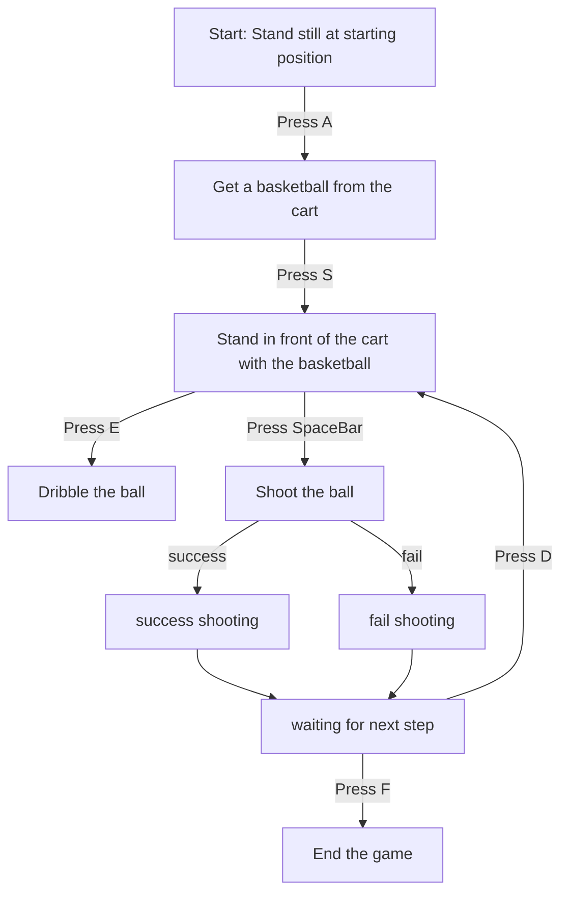

# Project Instructions

## Controls

- **A**: Move towards the basketball cart.
- **S**: Move towards the basketball hoop.
- **E**: Dribble the ball once.
- **Spacebar (Long Press)**: Shoot. A 1-2 second long press results in a successful shot; otherwise, the shot will miss.
- **D**: Return to the basketball cart to retrieve the ball.
- **F**: End the game.

## Gameplay Flow

## Repository

For more information and updates, visit our [GitHub Repository](https://github.com/lhzzzzzzz/ComputerGraphics_BasketballCai).